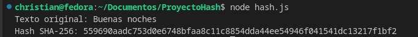
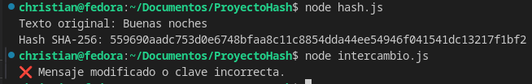

# Informe Técnico

## hash.js
Es el archivo de ejecución del hash. AL ser ejecutado, 
el archivo llama a su función obtenerHashSHA256 la cual
recibe un texto, en este caso "Buenas noches". La función
imprime el texto original. Posteriormente genera un hash
usando SHA256 y el texto, y lo convierte a hexadecimal 
para poder mostrarlo en la consola. 

## intercambio.js 
Es el archivo de ejecución del HMAC. AL ser ejecutado,
el archivo declara la clave secreta y llama a la función 
"enviarMensaje", la cual recibe el texto "CHRISTIAN TAMAYO"
y genera un HMAC usando la clave secreta y el texto 
recibido, luego el texto original junto con su hmac son
guardados en "mensaje.json"
Posteriormente la función "recibirMensaje" es llamada y 
revisa el contenido del archivo "mensaje.json" y lo guarda
en un objeto json. A continuación se calcula el HMAC 
del archvivo json recibido, y finalmente se compara si el
HMAC recibido y el calculado coinciden. 
Si coinciden muestra un mensaje de aprobación, caso 
contrario, una alerta. 

